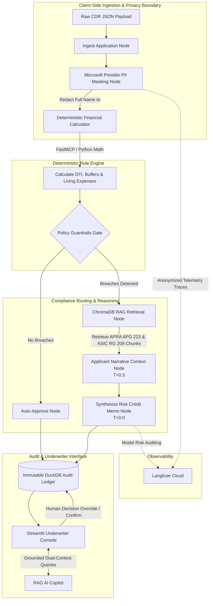

## Agentic AI Project (c) - Bhomik Chopra
# Responsible AI Mortgage Underwriting Platform (APRA / ASIC Compliant)

[](https://www.python.org/downloads/)
[](https://github.com/langchain-ai/langgraph)
[](https://github.com/microsoft/presidio)
[](https://www.trychroma.com/)
[](https://duckdb.org/)
[](https://langfuse.com/)

An enterprise-grade, regulatory-compliant AI credit assessment engine and Human-in-the-Loop (HITL) underwriting console designed for Australian Authorised Deposit-taking Institutions (ADIs).

The platform enforces strict regulatory compliance under **APRA APG 223** (Residential Mortgage Lending), **APRA CPS 234** (Information Security), **ASIC RG 209** (Responsible Lending Conduct), and the **Privacy Act 1988**.

---

## 1. System Architecture & Workflow

The platform decouples deterministic financial calculations from generative policy reasoning. Microsoft Presidio strips direct customer identifiers locally before payloads touch external LLMs or telemetry pipelines.




## 2. Directory Structure
```text
ResponsibleAI-Lending-APRA/
├── .env.example                       # Template for environment credentials
├── .gitignore                         # Excludes secrets (.env), DBs, and venv
├── requirements.txt                   # Project dependencies
├── README.md                          # Project technical documentation
├── data/
│   ├── audit_decisions.duckdb         # Local DuckDB immutable audit ledger
│   ├── chroma_db/                     # Persisted local Chroma vector store
│   ├── raw_cdr/                       # Synthetic Australian Open Banking CDR payloads
│   │   ├── APP-101.json               # Persona 1: Prime borrower (Auto-approval)
│   │   ├── APP-102.json               # Persona 2: DTI & buffer breach
│   │   ├── APP-103.json               # Persona 3: Living expense verification mismatch
│   │   └── APP-104.json               # Persona 4: High leverage & serviceability deficit
│   └── regulatory_docs/               # Ground truth regulatory policy PDFs
│       ├── APG_223_Residential_Mortgage_Lending.pdf
│       └── RG_209_Credit_Licensing_Responsible_Lending.pdf
├── src/
│   ├── __init__.py
│   ├── agent/
│   │   ├── __init__.py
│   │   ├── graph.py                   # LangGraph orchestration state machine
│   │   └── state.py                   # TypedDict underwriting state schema
│   ├── rag/
│   │   ├── __init__.py
│   │   └── vector_store.py            # ChromaDB vector indexer & semantic retriever
│   ├── tools/
│   │   ├── __init__.py
│   │   └── mcp_financial_server.py    # Deterministic financial calculators (DTI, buffer, HEM)
│   └── ui/
│       ├── __init__.py
│       └── main_app.py          # Streamlit HITL console with AI Copilot
└── test_scripts/
    ├── __init__.py
    └── test_graph.py                  # Automated test pipeline with Langfuse tracing
```

## 3. Synthetic CDR Test Cohort

The platform processes four standardized synthetic application profiles representing distinct credit risk and compliance test conditions[](start_span)[](end_span):

| Application ID | Applicant Name | Requested Loan | Annual Income | DTI Ratio | Stressed Buffer Surplus | Breached Policy | Regulatory Citation | Expected System Action |
| :--- | :--- | :--- | :--- | :--- | :--- | :--- | :--- | :--- |
| **APP-101** | Sarah Jenkins | $450,000 | $155,000 | 2.90x | +$1,420.50/mo | None | APRA APG 223 Attachment A | **AUTO_APPROVE** |
| **APP-102** | Rajiv Patel | $850,000 | $140,000 | 6.71x | -$2,807.76/mo | DTI ≥ 6.0x & Negative Surplus | APG 223 Page 19 (High DTI) & Page 12 (Buffer) | **ESCALATED_REFERRAL** |
| **APP-103** | Emily Chen | $520,000 | $110,000 | 4.72x | -$340.00/mo | Declared vs. CDR Expense Mismatch | ASIC RG 209.105 (Verification of Expenses) | **ESCALATED_REFERRAL** |
| **APP-104** | Emma Wright | $920,000 | $120,000 | 7.66x | -$3,401.87/mo | Severe Leverage & Serviceability Deficit | APG 223 Page 12 (+3.0% Minimum Floor) | **ESCALATED_REFERRAL** |


## 4. Regulatory Framework & Governance Matrix

* **Client-Side PII Redaction (Privacy Act 1988 & APRA CPS 234):** Microsoft Presidio and spaCy (`en_core_web_sm`) run locally within the ingestion node to strip direct customer identity tokens[](start_span)[](end_span). It converts raw applicant names to `<PERSON>` prior to invoking cloud LLM endpoints or external tracing tools[](start_span)[](end_span).

* **Deterministic Serviceability Engine (APRA APG 223):** Numerical ratios—including Debt-to-Income (DTI), Household Expenditure Measure (HEM) variances, and the mandated +3.00% interest rate stress buffer—are executed through pure Python routines in the FastMCP calculator rather than generative probabilistic models[](start_span)[](end_span).

* **Model Risk Management (MRM) Scoped Temperature:**
  * **T = 0.0 (Synthesis & Policy Extraction):** Strictly applied to credit memorandum drafting and regulatory retrieval to enforce deterministic outputs without hallucinatory variations[](start_span)[](end_span).
  * **T = 0.3 (Narrative Summaries):** Scoped to qualitative context nodes to compress borrower background notes into factual, concise credit context[](start_span)[](end_span).

* **Immutable Audit Trail (APRA APS 220 & CPS 230):** DuckDB captures all pipeline execution records, deterministic figures, identified policy breaches, human underwriter identity IDs, override justification notes, and ISO-8601 UTC timestamps[](start_span)[](end_span).

---

## 5. Underwriter Console & HITL Workflow

### A. Secure Gateway Authentication

Access to the underwriting console is controlled via an authenticated session gate[](start_span)[](end_span). Administrative configurations and state modification controls remain inaccessible until valid underwriter credentials are confirmed[](start_span)[](end_span).

### B. Master Underwriting Queue

The primary dashboard surfaces the comprehensive application queue populated directly from the DuckDB audit ledger[](start_span)[](end_span). Underwriters can view high-level metrics, system recommendations, policy flags, and filter files across pending, escalated, and approved states[](start_span)[](end_span).

### C. File Review, HITL Decisioning & AI Copilot

Selecting an application loads a dual-pane evaluation interface[](start_span)[](end_span):

* **Scorecard & Breach Breakdown:** Displays baseline vs. stressed ratios with color-coded status indicators (Pass/Breach) and direct regulatory paragraph citations[](start_span)[](end_span).
* **Human-in-the-Loop Override Form:** Enforces mandatory, non-blank rationale inputs before an underwriter can approve an exception, request additional proofs, or decline a mortgage[](start_span)[](end_span).
* **Grounded Regulatory Copilot:** A context-aware RAG assistant powered by ChromaDB answers natural-language underwriter inquiries by cross-referencing active loan figures with indexed APRA APG 223 and ASIC RG 209 texts[](start_span)[](end_span).

---

## 6. Installation & Quickstart

### 1. Prerequisites

* Python 3.10 or 3.11[](start_span)[](end_span)
* Google Gemini API Key[](start_span)[](end_span)
* Langfuse Account (Cloud or self-hosted for telemetry)[](start_span)[](end_span)

### 2. Environment Setup

Clone the repository and initialize a local virtual environment[](start_span)[](end_span):

```zsh
git clone [https://github.com/](https://github.com/)<your-username>/ResponsibleAI-Lending-APRA.git
cd ResponsibleAI-Lending-APRA

python3 -m venv .venv
source .venv/bin/activate
```

Install the platform dependencies and language assets[](start_span)[](end_span):

```zsh
pip install -r requirements.txt
python -m spacy download en_core_web_sm
```

### 3. Configure Environment Variables

Create a `.env` file in the project root[](start_span)[](end_span):

```env
GOOGLE_API_KEY="your-google-gemini-api-key"

# Langfuse Telemetry
LANGFUSE_PUBLIC_KEY="pk-lf-..."
LANGFUSE_SECRET_KEY="sk-lf-..."
LANGFUSE_HOST="[https://cloud.langfuse.com](https://cloud.langfuse.com)"
```

### 4. Build Regulatory Vector Index

Chunk and embed APRA APG 223 and ASIC RG 209 PDFs into the local ChromaDB vector store[](start_span)[](end_span):

```zsh
python -m src.rag.vector_store
```

### 5. Ingest and Underwrite Batch Cohort

Execute the LangGraph state machine across the synthetic CDR cohort (`APP-101` through `APP-104`) to generate audit entries in DuckDB[](start_span)[](end_span):

```zsh
python -m test_scripts.test_graph
```

### 6. Launch Underwriter Dashboard

Start the Streamlit application console[](start_span)[](end_span):

```zsh
streamlit run src/ui/app_streamlit2.py
```

* **Local URL:** `http://localhost:8501`[](start_span)[](end_span)
* **Default Underwriter Credentials:**
  * User: `admin` | Password: `password123`[](start_span)[](end_span)
  * User: `underwriter_01` | Password: `securepass`[](start_span)[](end_span)

---

## 7. License
